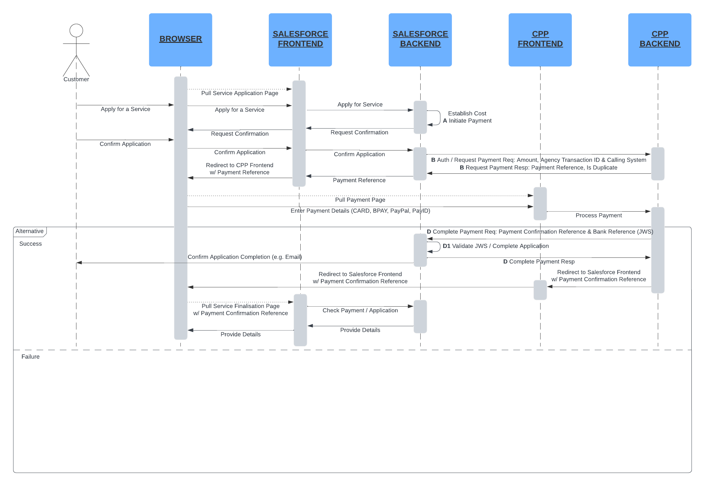
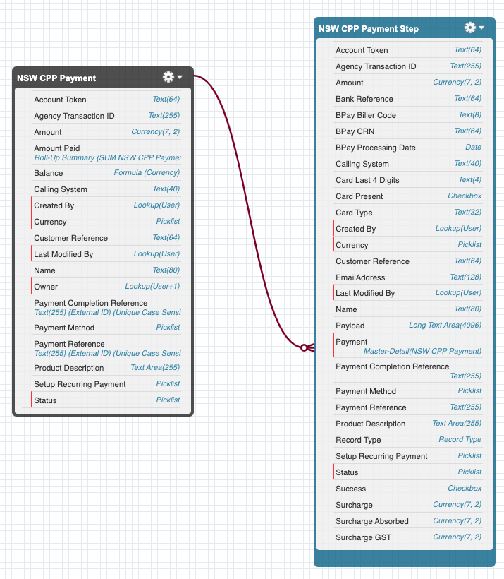

# NSW Customer Payments Platform (CPP) Integration

The [Customer Payments Platform CPP of the Australian state of New South Wales](https://www.digital.nsw.gov.au/delivery/government-technology-platforms/core-and-common-platforms/customer-payments-platform), also known as CPP, is a whole of government payment platform delivering a seamless, end-to-end payments experience across government and supporting a range of payment methods.

This Accelerator is a Salesforce-based solution designed to streamline the integration of the CPP with a Salesforce org by NSW Government departments or contractors. It allows to generate a CPP payment request, handles redirection to the NSW CPP payment page, and covers the finalisation of a payment when NSW CPP redirects back to the original site.

The Accelerator comes with a data model to keep track of payment requests and their status, back-end integration logic, as well as user experience blueprints.

By adopting this Accelerator, NSW Government departments or contractors can significantly reduce the time, risk and effort required to perform payments by leveraging the NSW CPP from their Salesforce org.

[Accelerator Listing](https://pubsec-accelerators.my.site.com/accelerators/accelerator/a0wDo0000024Nq6IAE/nsw-customer-payments-platform-cpp-integration)

## Description

NSW CPP is a robust, reusable payments capability put together by the NSW Department of Customer Service. It creates a more consistent customer experience and reduces cost by providing a preferred way of processing payments that generates economies of scale. 

While integrating Salesforce with NSW CPP is not overly complex, it so far has only been done ad-hoc for the needs of specific projects without reuse in mind.

This Accelerator aims at offering that integration at a much lower effort and risk by standardising the back-end processing and offering advanced blueprints for the user experience in a variety of Salesforce front-end technologies: we currently support OmniScript and Flow, and are strongly considering adding Visualforce as a further option to cater to the needs of departments and agencies with more established Salesforce orgs.

It includes:
* Front-end blueprints based on OmniScript and Flow,
* A data model supporting end-to-end payment processing from a Salesforce org consuming NSW CPP services and auditability,
* Integration with the NSW CPP back-end for both call-outs and call-ins,
* Authentication and security.

The Accelerator can be used with both unauthenticated and authenticated Experience Cloud experiences. It also covers usage directly from the Salesforce application for employee use cases.

### Target Audience

Kindly note that this Accelerator requires your organisation to be registered with NSW Department of Customer Service's [GTP team](mailto:GTPpartnership@customerservice.nsw.gov.au) for the use of CPP and is hence only relevant to NSW Government departments and their contractors.

### Limitations

At this stage, we have not tested NSWP CPP recurring payments even though the integration logic and data model fields are present. Please contact the maintainers if you have a recurring payment requirement.

## Documentation

### General Usage

The two provided user experience examples for Flow and OmniStudio outline the suggested general workflow:
* Create a unique Agency Transaction ID and assess the amount due, product description and customer reference; while these are captured as form editable fields in our examples, they should really be the byproduct of your solution's user experience prior to initiating a payment,
* Use the `InitiatePayment` operation,
* Use the `RequestPayment` operation (and handle eventual errors),
* Use the `PendPayment` operation,
* Redirect the user's browser to the Payment URL returned by NSW CPP as a result of `RequestPayment`,
* Have two separate pages of your Experience Cloud site to handle successful and failed payments (whose URL you will need to share with NSW DCS GTP upon registration for NSW CPP):
  * On failure, use the `ClosePayment` operation, let the user know and perform any operation your solution requires to cancel the transaction or save it for later,
  * On success, let the user know and perform any operation your solution requires to finalise the transaction, including a back-end validation of the payment.

As a user of the Accelerator, you only require knowledge of the following:
* [Payment Sequence Diagram](#payment-sequence-diagram),
* [Data Model](#data-model),
* [Configurability](#configurability),
* [Named Credentials](#named-credentials).

Other parts of this documentation are provided as background information for individuals interested in the implementation details.

### Payment Sequence Diagram

The flow of the end-to-end NSW CPP payment transaction as supported by the Accelerator is as follows:

### Data Model

The data model is meant as a blueprint centered on the payment, making no assumption regarding your overall functional requirements.

Two objects are defined:
* [NSW CPP Payment](#nsw-cpp-payment), keeping track of payment requests and their fulfilment,
* [NSW CPP Payment Step](#nsw-cpp-payment-step), offering a payment validation and audit trail functionality.

Extend the model as required to fit your needs. In particular, the provided NSW CPP Payment object could be linked to other data points, e.g. an Account, a Public Sector Solutions Individual or Business Licence Application etc.

#### NSW CPP Payment

`NSWCPPPayment__c` represents a NSW CPP payment request with further detail related as [`NSWCPPPaymentStep__c`](#nsw-cpp-payment-step) records.

In addition to holding the amount due (`Amount__c`), it also rolls-up the monies already paid (`AmountPaid__c`) from the related [`NSWCPPPaymentStep__c`](#nsw-cpp-payment-step) records and computes a balance (`Balance__c`).

Checking that the balance is 0 or less validates that no further monies are due and the related transaction can proceed.

#### NSW CPP Payment Step

`NSWCPPPaymentStep__c` offers a payment validation and audit trail functionality by logging every single step of a NSW CPP payment request with the following steps (also referred to as payment status): 
* `Initiated`, 
* `Pending`, 
* `Failed` and 
* `Complete`

The first three are front-end triggered while the last is back-end triggered and allows to validate completion before progressing the transaction on the front-end (but always re-validate payment completion when committing your transaction in the back-end).

The step record will contain the field values that are relevant for a specific step as per the NSW CPP documentation.

Other fields include:
* `Payload__c`, the full JSON payload from NSW CPP for completion steps,
* `Payment__c`, a relationship to the master payment record,
* `RecordTypeId`, with a record type defined per step,
* `Status__c`, a picklist with the payment status values outlined above,
* `Success__c`, a checkbox value that is aimed at capturing a callout success (vs. error) for statuses that involve a callout (currently kept for future use).

### Integration Logic

#### Call-outs

REST call-outs to NSW CPP are implemented in Apex. The relevant classes include:
* `NSWCPPCallout`,
* `NSWCPPCalloutGetPaymentStatus`,
* `NSWCPPCalloutRefundPayment`,
* `NSWCPPCalloutRequestPayment`.

##### NSWCPPCallout

`NSWCPPCallout` is a parent class for all call-out classes and it handles general configurability when it comes to [settings](#nsw-cpp-setting) and [calling systems](#nsw-cpp-calling-system).

##### NSWCPPCalloutGetPaymentStatus

`NSWCPPCalloutGetPaymentStatus` implements a REST call-out to the Get Payment Status operation as documented by NSW CPP.

##### NSWCPPCalloutRefundPayment

`NSWCPPCalloutRefundPayment` implements a REST call-out to the Get Refund Payment operation as documented by NSW CPP.

##### NSWCPPCalloutRequestPayment

`NSWCPPCalloutRequestPayment` implements a REST call-out to the Request Payment operation as documented by NSW CPP.

#### Call-ins / Apex REST Services

There is a single call-in/callback from NSW CPP when it confirms payment completion. It is implemented as an Apex REST service exposed on your Salesforce org and secured using JSON Web Signature:
* [`NSWCPPServicePaymentCompletion`](#nswcppservicepaymentcompletion).

##### NSWCPPServicePaymentCompletion

`NSWCPPServicePaymentCompletion` exposes a POST endpoint that accepts a single `token` payload attribute.
This is a JWS (JSON Web Signature, also known as signed JWT) as per the NSW CPP specifications for the payment completion service.

It verifies the token signature and leverages the `completePayment` method as outlined in the [`NSWCPPOperationComplete`](#nswcppoperationcomplete) class 
documentation to handle payment completion.

#### Persistence and auditability

Persistence and auditability of a payment are achieved using the following Apex classes:
* [`NSWCPPOperation`](#nswcppoperation),
* [`NSWCPPOperationClose`](#nswcppoperationclose),
* [`NSWCPPOperationComplete`](#nswcppoperationcomplete),
* [`NSWCPPOperationInitiate`](#nswcppoperationinitiate),
* [`NSWCPPOperationPend`](#nswcppoperationpend).

#### NSWCPPOperation

This is a base class used by all operations. It only contains an enumeration of the different operations as well as the `Id getRecordTypeIdByName(String name)` utility method to retrieve the RecordTypeId associated to each operation.

#### NSWCPPOperationClose

`NSWCPPOperationClose` is meant to be performed from the front-end. A request for this operation will include the following attributes:
* `paymentReference` (required), the payment reference returned by NSW CPP when requesting payment

It will return a `NSWCPPPaymentStep__c` record Id if the operation was successful.

#### NSWCPPOperationComplete

`NSWCPPOperationComplete` is meant to be performed by the back-end as a result of a payment completion in NSW CPP. `NSWCPPServicePaymentCompletion` exposes the right service API, which is invoked by NSW CPP, and that service API leverages `NSWOperationComplete` by calling its `Id completePayment(String compactJWS)` public static method.

`completePayment` sequences all the steps required to register a payment completion: 
* grab the NSW CPP public key from our settings,
* validate the JWS signature,
* find a `NSWCPPPaymentStep__c` record matching the payment reference with `Status__c` set to `Pending`,
* create a `NSWCPPPaymentStep__c` record with `Status__c` set to `Completed` -- the whole JWS payload is persisted in the `Payload__c` field.

#### NSWCPPOperationInitiate

`NSWCPPOperationInitiate` is meant to be performed from the front-end. A request for this operation will include the following attributes:
* `agencyTransactionId` (required),
* `amount` (required),
* `productDescription` (required),
* `customerReference` (required),
* `accountToken`, which needs to be provided when `setupRecurringPayment` is true,
* `setupRecurringPayment`, which defaults to false -- knowing that the Accelerator does not support recurring payments yet.

It will return a `NSWCPPPaymentStep__c` record Id if the operation was successful.

#### NSWCPPOperationPend

`NSWCPPOperationPend` is meant to be performed from the front-end after having requested payment from NSW CPP. A request for this operation will include the following attributes:
* `id` (required), the NSWCPPPayment__c record Id of the payment to pend,
* `paymentReference` (required), the payment reference as return when requesting payment from NSW CPP,
* `duplicate` (required), the value of the duplicate flag as returned when requesting payment from NSW CPP

### Configurability

We cater to configurability of the integration logic using custom metadata records ([`NSWCPPSetting__mdt`](#nsw-cpp-setting)) whose access from Apex code is abstracted through an Apex class (`NSWCPPSetting`). This latter class is used as required by other Accelerator assets. 

Those configuration parameters are regrouped in categories and include:
* `Completion` category, pertaining to configurability of the payment completion
  * `PublicKey`, the NSW CPP public key in PEM format to validate the completion message signature,
* `Callout` category, pertaining to configurability of technical aspects of the callout
  * `timeout` setting, the number of milliseconds before a callout is considered as timed out,
  * `compressed` setting, indicating wether the callout payload should be compressed or not.

We also enable configuring NSW CPP calling system records using custom metadata records ([`NSWCPPCallingSystem__mdt`](#nsw-cpp-calling-system)). That metadata is accessed as required by the `NSWCPPCallout` Apex class.

As a user of this Accelerator, your configuration tasks only require changing or creating custom metadata records.

#### Custom Metadata

There are two distinct Custom Metadata types used in this Accelerator:
* [NSW CPP Setting](#nsw-cpp-setting)
* [NSW CPP Calling System](#nsw-cpp-calling-system)

Access to that custom metadata for use in Apex is achieved through an Apex class:
* [`NSWCPPSettings`](#nswcppsettings)

##### NSW CPP Setting

`NSWCPPSetting__mdt` records work a key-value pairs where `Name` is the setting key and `Value__c` is the value; there is an additional `Category__c` free-text field that allows to regroup settings pertaining to the same functional area or category.

##### NSW CPP Calling System

`NSWCPPCallingSystem__mdt` records include the following fields:
* `Name`, the name of the calling system as shared with NSW DCS GTP during registration,
* `Network__c`, the Network name of the Experience Cloud site that triggers payment (with a special value of `__SALESFORCEAPP` that is used if the transaction is performed out of the Salesforce Application vs. an Experience Cloud site, e.g. for payments performed by staff on behalf of customers or refund requests),
* `NamedCredentials__c`, the name of the Named Credentials metadata record containing access credentials to NSW CPP for back-end integration (refer to the [post install setup and configuration](#post-install-setup--configuration)) guidance,
* `PaymentURL__c`, the URL of the target NSW CPP front-end page to collect payments with {paymentReference} added where that value should be merged, e.g. `https://pay.testservicensw.net/?paymentReference={paymentReference}`

It is worth noting that you may have multiple Calling System records pertaining to the same set of credentials/URL but addressing multiple Experience Cloud sites. You can decide to share NSW CPP credentials across sites (e.g. multiple sites pertaining to the same department or agency) or not (your Salesforce org have multiple sites serving the needs of separate departments and agencies which have their own NSW CPP arrangements).

##### NSWCPPSettings

This Apex class exposes three static methods:
* `Map<String, String> getSettingsMapForCategory(String category)`, which returns a map with all settings for a named category,
* `String getSettingFromMap(String name, Map<String, String> categoryMap)`, which returns the value for a named setting within a provided category map,
* `String getSettingSingle(String name)`, which returns a single setting based on its unique name.

#### Named Credentials

We provide neither external named credentials nor named credentials but you will need to set them up as outlined in the [post-install setup and configuration](#post-install-setup--configuration) section.

### To do

The following items are part of our to-do list:
* Better handling of errors when requesting payment in the front-end examples,
* Support for recurring payments. 

## Included Assets
This Accelerator includes the following assets:
<ol>
  <li>An <strong>unmanaged package</strong> for the Salesforce back-end (link below; metadata is also found in the `/force-app/main/default/` folder) that includes:
    <ul>
      <li>Apex classes, including test classes (x23)</li>
      <li>Custom apps and associated flexipages (x1)</li>
      <li>Custom metadata objects (x2)</li>
      <li>Custom objects (x2)</li>
      <li>Permission sets (x1)</li>
      <li>Reports (x4, as blueprints)</li>
    </ul>
  </li>
  <li>Metadata for the Salesforce front-end in the `/frontend/main/default folder` that includes:
    <ul>
      <li>Flows (x1, as a blueprint for Flow-based user experiences)
      <li>OmniStudio Omniscripts (x3)</li>
    </ul>
  </li>
  <li><strong>Documentation</strong>, including:
    <ul>
      <li>This readme file</li>
      <li>White paper providing detailed setup instructions and a data dictionary (located in the /docs/ folder)</li>
    </ul>
  </li>
</ol>

## Before You Install

**License Requirements**

Licence Salesforce Platform or higher for internal; external (constituent) use does not require any licence when used for anonymous payments off an Experience Cloud portal.

However, a single Salesforce Public Sector Foundation licence would be required to leverage the OmniScript-based front-end in a guest user setup. 

Customer Community logins or members (or higher) would be required for authenticated use with a Flow-based payment user experience; Customer Community for Public Sector logins or members (or higher) would be required to leverage the OmniScript-based payment user experience.

**Accelerator or Technology-Specific Assumptions**

Your organisation must be part of the NSW Government and have registered with the NSW Department of Customer Service's GTP team for use of the NSW Customer Payments Platform.

You must have installed and configured OmniStudio to install OmniStudio-based metadata. Remove OmniStudio-based metadata before installing as source code if you'd like to run off Platform licences.

**General Assumptions**

We strongly suggest using this Accelerator in a sandbox or test environment first. It is recommended that you do not install any Accelerator directly into production environments before having performed extensive non-production testing.

If you do not have a Salesforce org licensed to you, you may try Public Sector Solutions for free with one of our [trial environments](https://developer.salesforce.com/free-trials/comparison/public-sector).

## Installation

[Required. Steps necessary for installing the Accelerator. This can include images/screenshots which must be stored in the /docs/ folder (no external images or images stored elsewhere in the repository).]

## Post-Install Setup & Configuration

[Required. Steps necessary for using the Accelerator. This can include images/screenshots which must be stored in the /docs/ folder - no external images or images stored elsewhere in the repository.]

#### Credentials

You will need to set both External Named Credentials and Named Credentials but we do not have any requirements on naming.
Once you have created an Experience Cloud site, you will also need to create a Calling Systems metadata record.

#### External Named Credentials

Set an External Named Credentials record for access to the NSW CPP test service up as follows:
1. Pick a name and label, e.g. `NSWCPP ENC Test` and `NSWCPP_ENC_Test`,
1. Select `OAuth 2.0` as the Authentication Protocol,
1. The Authentication Flow Type should be `Client Credentials with Client Secret Flow`,
1. The Scope is `refresh_token`,
1. Assign the Identity Provider URL as directed by NSW DCS GTP, e.g. `https://api-psm.g.testservicensw.net/cpp-digital`,
1. Add `400` as Additional Status Code for Token Refresh

Once the External Named Credentials record is created, add a new Principals record:
1. Set as Parameter Name,
1. Leave Sequence Number as is,
1. Assign the Client ID and Client Secret as directed by NSW DCS GTP.

You External Named Credentials record are now ready to be used. When considering production use, you will need to set up a further record for the production NSW CPP service.

#### Named Credentials

Create a new Named Credentials record for access to the NSW CPP test service as follows:
1. Pick a name and label, e.g. `NSWCPP NC Test` and `NSWCPP_NC_Test`,
1. Set the URL as `https://api-psm.g.testservicensw.net/cpp-digital`,
1. Leave Enabled for Callouts checked,
1. Select the External Named Credentials record you just created, e.g. `NSWCPP ENC Test`,
1. Leave Client Certificate empty,
1. Leave Callout Options as they are,
1. Add `omnistudio` in the Allowed Namespaces for Callouts if you plan on using OmniStudio on the front-end.

#### Calling Systems Metadata Record

Create one record per Experience Cloud site where you plan on using this Accelerator:
1. In Salesforce Setup, navigated to `Setup` > `Custom Code` > `Custom Metadata Types`. Locate the `NSW CPP Calling Systems` Metadata Type and click on the `Manage Records` link.
1. x
1. Pick a Name and Label,
1. Set Network to the name of your target Experience Cloud site as per 
1. Set the Named Credentials field to the Name of the Named Credentials record you created above,
1. Set the Payment URL field as directed by NSW DCS GTP, making sure you add the query parameter string stub required to pass the payment reference, e.g. `https://pay.testservicensw.net/?paymentReference=`

By doing this, the Accelerator will automatically associate the right Named Credentials when authenticating with NSW CPP to perform a payment callout

## Additional Resources

[Optional. Summary list of additional links and references that you think are useful to. These links should be restricted to official Salesforce web resources and should not include third party references. Use an unordered list.]

## Revision History

<strong>1.0 Initial release (1 Nov 2024)</strong> - Integration logic for NSW CPP and User Experience blueprints for OmniStudio and Flow.

## Acknowledgements

Accelerator contributors and maintainers:
* Daniel Rushbrook (Salesforce Global Public Sector)
* Josh Lyons (Salesforce Global Public Sector)
* Matt Clements (Salesforce Global Public Sector)
* Emmanuel Schweitzer (Salesforce Global Public Sector)

## Terms of Use

Thank you for using Global Public Sector (GPS) Accelerators.  Accelerators are provided by Salesforce.com, Inc., located at 1 Market Street, San Francisco, CA 94105, United States.

By using this site and these accelerators, you are agreeing to these terms. Please read them carefully.

Accelerators are not supported by Salesforce, they are supplied as-is, and are meant to be a starting point for your organization. Salesforce is not liable for the use of accelerators.

For more about the Accelerator program, visit: [https://gpsaccelerators.developer.salesforce.com/](https://gpsaccelerators.developer.salesforce.com/)
